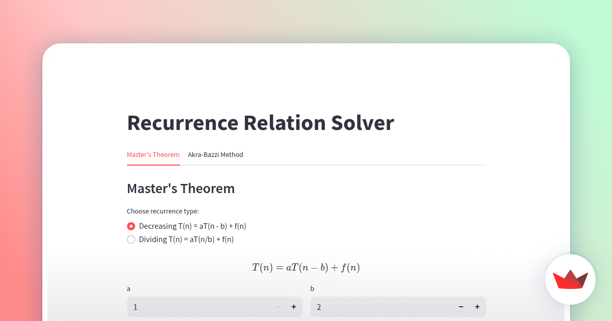

# Recurrence Relation Solver



This is a Streamlit-based web application for solving recurrence relations using two popular methods:

1. **Master's Theorem** - For recurrence relations of the forms:
   - T(n) = aT(n-b) + f(n) (Decreasing case)
   - T(n) = aT(n/b) + f(n) (Dividing case)

2. **Akra-Bazzi Method** - For more complex recurrences with multiple terms:
   - T(n) = a₁T(n/b₁) + a₂T(n/b₂) + ... + f(n)

## Installation

```bash
pip install -r requirements.txt
```

## Usage

Run the application using the following command:

```bash
streamlit run streamlit_app.py
```

The web interface will open in your browser where you can:
- Select between Master's Theorem and Akra-Bazzi Method
- Input the parameters for your recurrence relation
- View the generated equation
- Solve and get asymptotic complexity results in standard notation

## Dependencies

- Python 3.13.1
- Streamlit